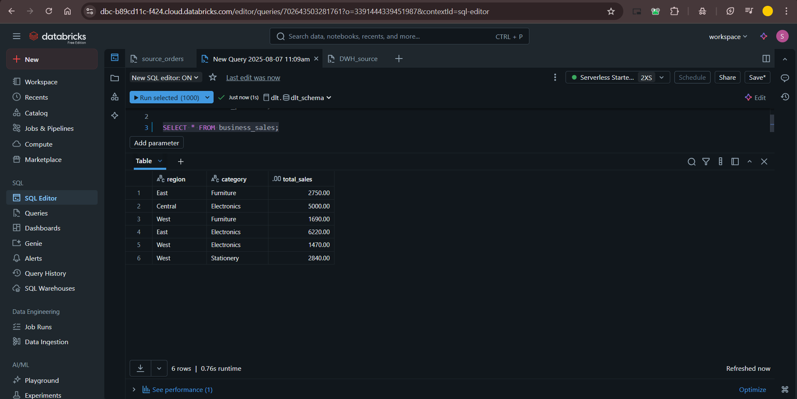

# DLT-Project

# Databricks Declarative Pipelines (Delta Live Tables) Medallion Architecture Project

This repository contains an end-to-end implementation of a data pipeline using **Databricks Declarative Pipelines, also known as Delta Live Tables (DLT)**. The project focuses on building a **Medallion Architecture (Bronze, Silver, Gold layers)**, incorporating **Slowly Changing Dimensions (SCD) Type 2**, and implementing **data quality checks** and **automatic dependency management**. This solution leverages the latest Databricks UI and API changes from June 2025, providing a modern approach to data engineering on Databricks.

## Table of Contents

*   [Project Overview](#project-overview)
*   [Key Features](#key-features)
*   [Architecture](#architecture)
*   [Prerequisites](#prerequisites)
*   [Setup & Installation](#setup--installation)
*   [Project Structure](#project-structure)
*   [How to Run the Pipeline](#how-to-run-the-pipeline)
*   [Validation](#validation)
*   [Monitoring & Advanced Features](#monitoring--advanced-features)
*   [Important Notes](#important-notes)

## Project Overview

This project demonstrates how Databricks Declarative Pipelines revolutionize data engineering by allowing users to **declare what they want (e.g., transformations, data quality rules)**, while **DLT automatically handles how it should be done** (e.g., orchestration, infrastructure, error handling). The core components of DLT, including **streaming tables, materialized views, batch views, and streaming views**, are explored and utilized.

The main objective is to build a sales data warehouse following the Medallion Architecture, integrating sales data from multiple regions (East and West), and dimension data for products and customers. A key highlight is the implementation of **SCD Type 2** for dimension tables, which historically requires significant effort but is greatly simplified with DLT's `auto CDC` capabilities.

## Key Features

*   **Declarative ETL Framework**: Define data pipelines using simple SQL or Python code, letting DLT manage dependencies, transformations, and automation.
*   **Automatic Dependency Management**: DLT automatically understands and orchestrates the flow of data based on how tables and views reference each other, eliminating the need for manual DAG configuration.
*   **Incremental Processing (Change Capture)**: Efficiently processes only new data, a critical feature for big data environments, supported by streaming tables and views.
*   **Unified Batch and Streaming**: Use the same code for both batch and streaming operations, with DLT automatically detecting the data source type and handling it accordingly.
*   **Built-in Data Quality Checks (Expectations)**: Define rules (e.g., "column should not be null") to ensure data quality. DLT provides options to drop records, warn, or fail the entire flow if expectations are not met.
*   **`Append Flow` API**: A powerful feature for combining multiple streaming sources into a single target streaming table, highly useful for unionizing data from various regions.
*   **`Auto CDC` (Change Data Capture)**: Simplifies the creation of upserted tables and Slowly Changing Dimensions (SCD Type 1 and Type 2) without writing complex merge logic. It manages updates and inserts based on key and sequence columns.
*   **Modern Lakeflow Code Editor UI**: Utilizes the new Databricks UI for building pipelines, offering a purpose-built IDE with folder-based organization, multiple tabs, and improved developer experience.
*   **Medallion Architecture Implementation**: Structures data into Bronze (raw), Silver (cleaned/transformed), and Gold (curated/business-ready) layers.
*   **Slowly Changing Dimensions (SCD Type 2)**: Tracks the history of changes in dimension tables automatically, adding `start_date`, `end_date`, and `in_use` flags.
*   **Pipeline Monitoring**: Offers detailed monitoring dashboards, event logs, and the ability to set up notifications for pipeline failures.
*   **Free Databricks Edition Compatibility**: The entire project can be run on Databricks Free Edition, making it accessible to all learners.

## Architecture

The project implements a **Medallion Architecture** for a sales data warehouse:

*   **Bronze Layer (Ingestion)**:
    *   Ingests raw sales data from `sales_east` and `sales_west` sources into a unified `sales_STG` streaming table using the **`append_flow` API**.
    *   Ingests raw `products` and `customers` data into `products_STG` and `customers_STG` streaming tables.
    *   **Data quality expectations** are applied at this layer (e.g., `sales_ID` not null, `product_ID` not null, `price` greater than 0).

*   **Silver Layer (Transformation/Enrichment)**:
    *   Creates **upserted streaming tables** for `sales_enriched`, `products_enriched`, and `customers_enriched` from their respective Bronze layer sources using **`create_auto_cdc_flow`**. These tables capture changes and updates.
    *   Transformation logic (e.g., calculating `total_amount`, casting `price` to integer, converting `customer_name` to uppercase) is applied via streaming views (`sales_STG_transform`, `products_STG_transform`, `customers_STG_transform`) before feeding the upserted tables.

*   **Gold Layer (Curated/Business Views)**:
    *   Builds **dimensional tables (`dim_products`, `dim_customers`)** as **Slowly Changing Dimension Type 2 (SCD Type 2)** using `create_auto_cdc_flow`, tracking historical changes. These dimensions are sourced from their respective Silver layer *views* to ensure append-only behavior for streaming transformations.
    *   Creates a **fact table (`fact_sales`)** as an upserted table (SCD Type 1) from the `sales_enriched_view`.
    *   A **materialized business view (`business_sales`)** is created by joining the fact and dimension tables, performing aggregations (e.g., `total_sales` by region and category) to support specific business use cases. This materialized view processes all data, unlike streaming views, ensuring complete aggregated results.

## Prerequisites

To run this project, you will need:

*   **Databricks Account**: A Databricks Free Edition account is sufficient. No business email, Azure subscription, or credit card is required.
*   **Basic Databricks Knowledge**: Familiarity with Databricks workspace, catalogs, schemas, and basic Python/SQL is helpful.
*   **Databricks Experimental Features Enabled**:
    *   Go to **Settings > Developer**.
    *   Enable **"Lakeflow pipeline editor"**. This is crucial for experiencing the new UI and structured folder-based authoring.
    *   (Optional) Enable other previews or change editor themes for a personalized experience.

## Setup & Installation

1.  **Create Databricks Free Edition Account**:
    *   Go to any browser and search for "Databricks Free Edition".
    *   Click on "Try Databricks" and then "Looking for Databricks Free Edition? Click here".
    *   Login with your normal Gmail account.
    *   Once created, use the "Login" button to access your workspace.

2.  **Create Catalog and Schemas**:
    *   In your Databricks Workspace, navigate to the **Catalog** tab.
    *   Click the **"+" button** and select **"Create a Catalog"**. Name it `DLT_ON` (or any preferred name) and configure it for `All Workspaces have access` and `All privileges`.
    *   Within your `DLT_ON` catalog, create two schemas:
        *   **`source`**: To store raw source tables.
        *   **`DLT_schema`**: To store all objects created by the DLT pipeline (streaming tables, materialized views).

3.  **Upload Source Data (SQL DDL)**:
    *   Clone this GitHub repository to your local machine.
    *   In Databricks, go to the **Workspace** tab.
    *   Create a new folder (e.g., `declarative_pipelines`).
    *   Within this folder, create a new **Query**. Rename it `data_warehouse_source`.
    *   Open the `SQL_DDL.sql` file from this repository (located in `delta_live_tables/SQL_DDL.sql`).
    *   **Crucially, ensure your SQL editor is set to the `DLT_ON` catalog and `source` schema**.
    *   Copy and paste the `CREATE TABLE` and `INSERT INTO` statements for `sales_east`, `sales_west`, `products`, and `customers` into your Databricks SQL editor.
    *   **Run each `CREATE TABLE` and its initial `INSERT INTO` statement individually** (select the code and click "Run selected" or "Run" if it's the only statement) to populate your `source` schema with initial data. **Do NOT run the incremental load statements yet**.

## Project Structure

The DLT pipeline source code is organized into a `DLT_root` folder within your Databricks workspace, following best practices for modularity.

*   `DLT_root/`
    *   `bronze/`
        *   `injection_customers.py`: Ingests customer data with quality checks.
        *   `injection_products.py`: Ingests product data with quality checks.
        *   `injection_sales.py`: Ingests sales data from East/West sources using `append_flow` with quality checks.
    *   `silver/`
        *   `transform_customers.py`: Transforms customer data (e.g., uppercase customer name) and creates an upserted Silver table and a streaming view for Gold.
        *   `transform_products.py`: Transforms product data (e.g., cast price to int) and creates an upserted Silver table and a streaming view for Gold.
        *   `transform_sales.py`: Transforms sales data (e.g., calculates total amount) and creates an upserted Silver table and a streaming view for Gold.
    *   `gold/`
        *   `dim_customers.py`: Creates SCD Type 2 dimension for customers.
        *   `dim_products.py`: Creates SCD Type 2 dimension for products.
        *   `fact_sales.py`: Creates an upserted fact table for sales.
        *   `business_sales.py`: Creates a materialized business view for aggregated sales by region and category.
    *   `explorations/`
        *   `example_exploratory_notebook.py`: A non-source code folder for quick data exploration and debugging during development. Files here are **not run** as part of the pipeline.
    *   `tutorial/` (Commented out in this project): Contains initial examples and core component demonstrations.

## How to Run the Pipeline

1.  **Create DLT Pipeline**:
    *   In Databricks, navigate to the **Jobs and Pipelines** tab.
    *   Click **"Create"** and select **"ETL Pipeline"**.
    *   Set the **Catalog** to `DLT_ON` and **Schema** to `DLT_schema`.
    *   Enable **"Lakeflow pipelines editor"**.
    *   Select **"Start with sample code in Python"**.

2.  **Move Root Folder and Import Files**:
    *   Once the new pipeline UI loads, it creates a default root folder (e.g., "new pipeline"). **Rename this root folder** to `DLT_root` (or your preferred name).
    *   **Move this `DLT_root` folder** into your desired workspace directory (e.g., `declarative_pipelines`) using the **"Move root folder"** option from the three dots menu next to the root folder name. **Do not copy/paste files outside the assets browser** as it will break synchronization.
    *   **Create the `bronze`, `silver`, and `gold` subfolders** within `DLT_root` via the assets browser.
    *   **Create new files** within these subfolders (e.g., `injection_sales.py` in `bronze/`) and copy the Python code from the respective files in this GitHub repository into them. Ensure to un-comment the code as you copy it.

3.  **Run the Pipeline**:
    *   In the DLT pipeline UI, click **"Dry Run"** initially to visualize the DAG and check for any immediate syntax errors without processing data.
    *   Once the dry run is successful, click **"Run Pipeline"**. This will execute the entire DLT pipeline, ingest data, apply transformations, and build the Medallion Architecture.
    *   The pipeline will show its progress and lineage graph in real-time. All tasks should turn green upon successful completion.

## Validation

After the initial pipeline run:

1.  **Check Catalog**: Navigate to the **Catalog** tab in Databricks. In your `DLT_ON` catalog and `DLT_schema`, you should see all the created streaming tables and materialized views (e.g., `sales_STG`, `products_STG`, `customers_STG`, `sales_enriched`, `products_enriched`, `customers_enriched`, `dim_products`, `dim_customers`, `fact_sales`, `business_sales`).

2.  **Query Tables**: Use the SQL editor to query your tables and views, especially the Gold layer tables:
    *   `SELECT * FROM DLT_ON.DLT_schema.dim_products`
    *   `SELECT * FROM DLT_ON.DLT_schema.dim_customers`
    *   `SELECT * FROM DLT_ON.DLT_schema.fact_sales`
    *   `SELECT * FROM DLT_ON.DLT_schema.business_sales`

3.  **Validate SCD Type 2**:
    *   Go back to your `data_warehouse_source` SQL query in Databricks.
    *   **Run the `INSERT INTO` statements for incremental data** (for `sales_east`, `sales_west`, and especially `products` updates) that you previously commented out. This will add new records and update existing ones in your source tables.
    *   **Rerun the DLT pipeline**.
    *   After the run, query `dim_products` again. You should observe new rows for updated products, with the `end_date` populated for the older versions and `null` for the latest versions, demonstrating successful SCD Type 2 implementation.

## Monitoring & Advanced Features

*   **Pipeline Monitoring Dashboard**: In the **Jobs and Pipelines** tab, click on your DLT pipeline. The canvas provides a detailed overview of the latest run, showing processed records, upserted records, and expectation fulfillment.
*   **Expectations**: Click on any task in the pipeline graph and then the "Expectations" tab to see if your data quality rules (defined in Bronze layer) were met (100% met should be shown for healthy data).
*   **Notifications**: In pipeline settings, you can configure email notifications to be alerted if the pipeline fails or encounters errors.
*   **Parameters**: DLT pipelines support parameters (key-value pairs) via the settings, which are always passed as strings and may require parsing in your code.
*   **Scheduling**: Pipelines can be scheduled to run at specific intervals (e.g., daily, hourly) for automated execution.
*   **Integration with Databricks Jobs**: DLT pipelines can be orchestrated as tasks within broader Databricks Jobs, allowing for complex multi-component workflows.

## Important Notes

*   **Databricks Free Edition Limits**: When using Databricks Free Edition, **avoid opening too many tabs, files, or notebooks simultaneously** as resources can be exhausted. If you encounter "resources exhausted" errors, wait 30-60 minutes and refresh your workspace.
*   **Delete Old Pipelines**: If you create a new DLT pipeline, **ensure to delete existing ones** to conserve free resources.
*   **Dry Run First**: Always use "Dry Run" before a full pipeline run to check for errors and visualize the DAG without consuming significant compute resources.
*   **YAML Configuration**: The underlying configuration of DLT pipelines is often represented in YAML, which is becoming increasingly popular in declarative frameworks. Familiarity with basic YAML syntax is beneficial.

## Project Output

1. **Products Dimensions**

2. **Business Sales**

---

Feel free to explore the code, experiment with transformations, and adapt it for your own data engineering challenges! Happy learning!